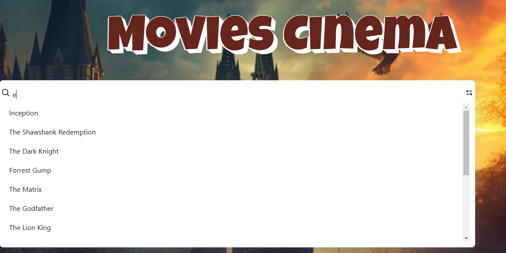
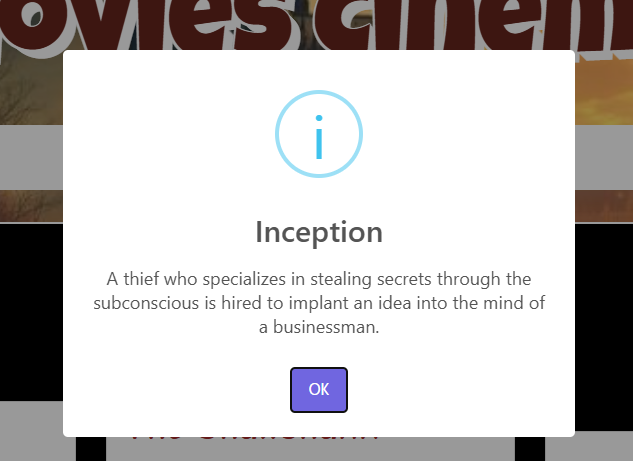
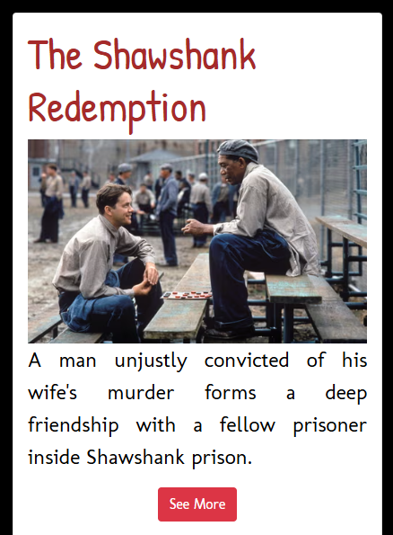
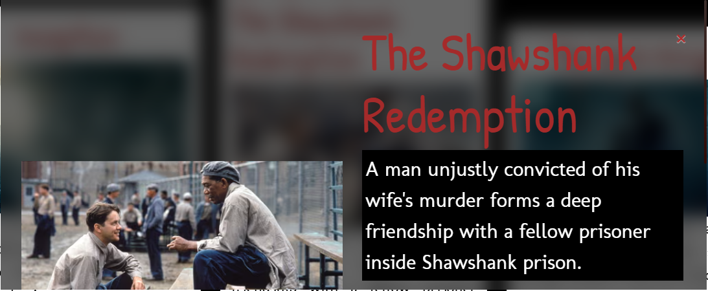

# Movies Cinema
## Descripción:
    Este proyecto consiste en el desarrolló de un aplicativo web el cual permite buscar películas, su visualización con su información, toda la información se encuentra en un archivo JS. El proyecto se puede visualizar en el siguiente link: 

## Barra de Búsqueda:
    En la barra de búsqueda el usuario podrá buscar el nombre de la película, los cuales se obtienen del archivo con la información agregándolos a una lista como los posibles resultados de búsqueda.
    

    Al dar click sobre uno de ellos se desplegará una alerta con la descripción de la película.
    
    

## Cartas de Películas:
    Con la información obtenida de la data se crean las cartas por cada película que se encuentre en nuestro archivo con la información, de esta manera si se desea agregar una nueva película esta se crea automáticamente sin realizar cambios en el archivo HTML.
    

## Ventana Modal:
    En la carta creada se define un botón, al presionarlo este me permite visualizar una ventana emergente con información adicional sobre la película seleccionada, este contiene un botón el cual le permite salir de la ventana.
    

## Tecnologías Utilizadas:
    - HTML                                     - JavaScript
    - CSS                                      - Bootstrap                                     
    - Librería Sweetalert